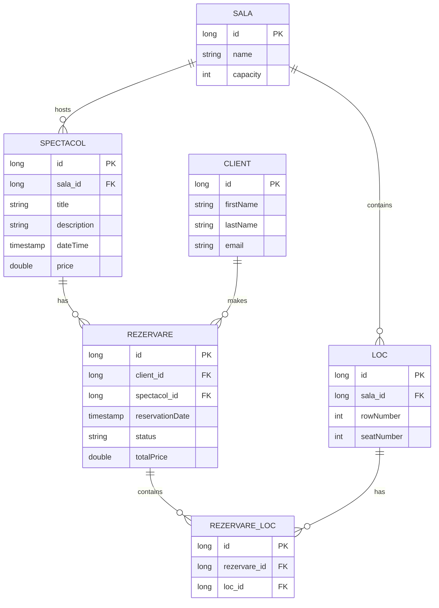

# 🎭 Spectacol - Theater Reservation System

## Project Description

Spring Boot application for managing theater shows and seat reservations in a performance hall.

## What The System Does

- Managing theater halls and automatic seat generation
- Managing shows associated with a hall
- Client registration
- Creating reservations for one or multiple seats
- Cancelling reservations
- Viewing available seats for a show

---

## ERD Diagram

---

## Functional Requirements

1. The system must allow creation and management of theater halls
2. The system must automatically generate seats by rows and seat numbers
3. The system must allow creation and management of shows associated with a hall
4. The system must allow client registration with email validation
5. A client can create a reservation for one or multiple seats
6. The system must verify seat availability before creating a reservation
7. A seat cannot be reserved twice for the same show
8. The system must automatically calculate the total price of a reservation
9. The system must allow cancellation of a reservation
10. The system must allow viewing available seats for a show